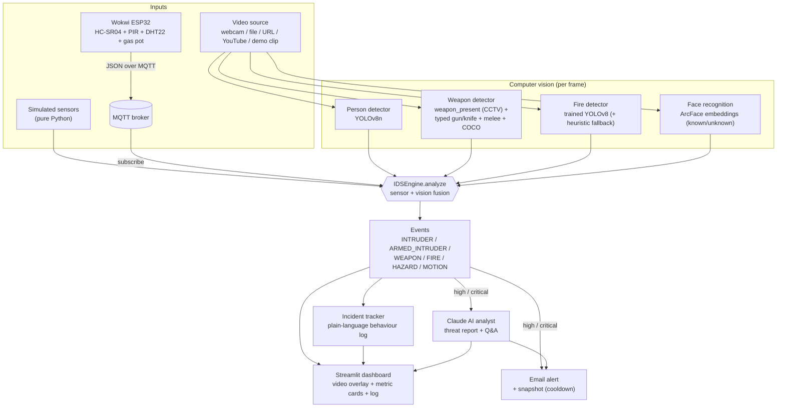

# 🛡️ Sentinel IDS

[](https://share.streamlit.io/deploy?repository=rishika1099/Sentinel-Intruder-Detection-System&branch=main&mainModule=app.py)

A surveillance grade **Intruder Detection System** that fuses **sensors** (simulated
in Python or fed live from a Wokwi simulated ESP32 over MQTT) with a stack of
**computer vision models**. It detects people and whether they are known or
unknown, estimates distance from an ultrasonic sensor, flags weapons (guns and
knives via custom trained YOLO models), detects fire, narrates what an intruder
was doing in plain language, optionally writes an AI threat report with Claude,
and **emails the owner** with a snapshot when something serious happens.

Everything runs locally through a Streamlit dashboard. It is also deployable to
Streamlit Community Cloud.

> **Live app:** the deployed instance runs from this repo. The cloud build uses
> headless OpenCV and has no webcam, so use the built in **Demo clip** picker or
> paste a video URL. The full real time, webcam experience is local via
> `streamlit run app.py`.

---

## Architecture



The video frame fans out to four vision models; the sensor readings (simulated
or live from the board) join them in `IDSEngine.analyze`, which classifies the
situation into events. Events drive the dashboard, the incident log, the email
alert, and the optional Claude analyst.

---

## What it does

| Capability | How |
|---|---|
| Presence + distance | HC-SR04 ultrasonic + PIR motion (simulated or Wokwi), fused with vision |
| Person detection | YOLOv8n |
| Weapon detection | CCTV trained `weapon_present` (high recall) + curated `weapon_typed` gun/knife layer + melee + COCO |
| Known vs unknown faces | ArcFace embeddings (InsightFace), enroll from webcam (Stage 2) |
| Fire detection | Trained YOLOv8 fire model, color heuristic fallback |
| Hazard (gas / heat) | Simulated MQ-2 smoke + temperature, fused with vision fire |
| Incident narration | Behaviour summary per incident (approach, direction, armed, identity) |
| AI threat report | Optional Claude (vision + text): scene description, assessment, incident Q&A |
| Alerts | Email to owner with snapshot, per event cooldown (owner then calls 911) |
| Hardware | Wokwi ESP32 publishes sensor JSON over MQTT, app subscribes |
| Video input | Webcam, local file, direct URL, YouTube link, or one click demo clip |

> On 911: emergency services cannot be dialed through an API by an individual
> app. Sentinel alerts the **owner**, who makes the 911 call. The recipient and
> text are configurable.

---

## Models and measured metrics

All numbers are on held out test data (never seen in training), at the app's
operating thresholds. Reproduce with `training/benchmark.py`.

| Model | What it does | Result |
|---|---|---|
| `weapon_present.pt` | Generic "weapon present" (CCTV trained, high recall) | test mAP@0.5 **0.81**; on real web images 3/3 guns+knife, **0 false alarms**, 0/119 video frames |
| `weapon_typed_s.pt` | Curated gun vs knife typing (YOLOv8s) | held out **knife mAP 0.92**, gun 0.82, overall 0.87 |
| `melee.pt` | Knife / sword / axe / spear typing | held out mAP@0.5 **0.85** |
| Face recognition | ArcFace known vs unknown | genuine match 0.65 vs impostor <= 0.10 (clean separation), ~99 percent class on standard benchmarks |
| `fire.pt` | Trained fire detector | 1/1 fire detected, 0 false positives (rejects sunset, fog, warm scenes) |
| Person | YOLOv8n | reliable, 0 false positives on no person scenes |

Honest note on the academic ceiling: free weapon datasets carry roughly 5 to 6
percent label noise (whole image "weapon" boxes), which caps mAP. Sourcing a
**curated** dataset (`Turki-Alshuaibi/haris-weapon-detection-dataset-curated`,
0.3 percent bad boxes) is what pushed knife mAP past 0.90 and restored gun vs
knife typing. With clean labels a larger model (YOLOv8s) finally helped, the
opposite of what happened on noisy data.

### How weapon detection is layered

1. `weapon_present` (single class, CCTV trained) catches a weapon with high
   recall and a generic "weapon" label.
2. `weapon_typed` (curated gun + knife) runs as a **typing layer**: it relabels
   an overlapping generic box as "gun" or "knife" when it is confident. Its own
   out of distribution false positives never surface, because it only renames
   boxes the primary model already flagged.
3. `melee` adds sword / axe / spear, COCO adds baseball bat / scissors.
4. A weapon must appear in at least **2 of the last 3 frames** before it counts,
   so a single frame blip cannot raise a false armed alert.
5. Test time augmentation (toggle in the sidebar) adds about 3 points of mAP and
   higher confidence with no extra false positives.

---

## Event logic (`ids/engine.py`)

- **ARMED_INTRUDER** (critical): a person and a weapon in frame. Still critical
  if the face is known; the message names who.
- **WEAPON** (critical): a weapon with no person visible.
- **FIRE** (critical): the fire model sees fire, or simulated temperature **and**
  smoke are both high.
- **HAZARD** (high): temperature or smoke high on their own (gas leak, overheat).
- **INTRUDER** (high inside the distance zone, else medium): an unidentified person.
- **KNOWN_PERSON** (info): a recognized enrolled person.
- **MOTION** (low): PIR motion with no person visible.

High and critical events send an email (subject, body, snapshot), rate limited
per event type by `alert_cooldown_s`.

### Incident log (what the intruder was doing)

Instead of one identical line per frame, `ids/activity.py` groups a continuous
stretch of activity into a single incident and narrates it: duration, approach
or retreat (with distances), which way the subject crossed the view, loitering,
armed and with what, known vs unidentified. Example:

```
02:22:03-02:22:21 (18s): armed person; approached (360->120cm); crossed view L->R; carrying firearm
```

---

## Sensors: simulated or Wokwi hardware

Sensors can run two ways, selectable in the sidebar:

- **Simulated (pure Python):** Auto mode makes readings react to the video (a
  detected person makes the ultrasonic report a near distance); Manual mode
  gives you sliders to stage any scenario.
- **Wokwi hardware (MQTT):** a simulated ESP32 reads HC-SR04 (distance), PIR
  (motion), DHT22 (temperature), and a potentiometer standing in for an MQ-2 gas
  sensor, then publishes JSON to an MQTT topic. The app subscribes and feeds the
  readings into the same engine. See `wokwi/README.md`. The same sketch runs on
  a real ESP32 unchanged.

```
Wokwi ESP32  --WiFi-->  MQTT broker  -->  Sentinel IDS
HC-SR04, PIR, DHT22, gas pot           Sensors = "Wokwi hardware (MQTT)"
```

---

## Setup (local)

```bash
cd ~/Desktop/IDS
python3 -m venv .venv
source .venv/bin/activate
pip install -r requirements.txt

# Optional, for ArcFace face recognition locally (omitted on cloud):
pip install insightface onnxruntime
pip uninstall -y opencv-python opencv-python-headless   # let contrib win for cv2.face
pip install opencv-contrib-python
```

Optional secrets in a `.env` file (copy `.env.example`):

```
ANTHROPIC_API_KEY=...     # enables the Claude AI analyst (optional)
ROBOFLOW_API_KEY=...      # only for downloading training datasets
SMTP_USER=...             # email alerts
SMTP_PASSWORD=...         # Gmail: use an App Password
ALERT_TO=owner@example.com
```

## Run

```bash
source .venv/bin/activate
streamlit run app.py
```

Then: pick a video source (leave it on **Demo clip** to try it with no setup),
tune **Detection** and **Sensors** in the sidebar, optionally fill in **Email
alerts**, and press **Start**.

Offline smoke test (no webcam or extra models needed):

```bash
python selftest.py
```

---

## Deploy to Streamlit Community Cloud

1. Click the **Open in Streamlit** badge, sign in with GitHub, set the main file
   to `app.py`, and **Deploy**.
2. On the hosted app, pick **Demo clip** (the cloud has no webcam) and **Start**.

The repo is already cloud ready:
- `requirements.txt` uses **`opencv-python-headless`** (full OpenCV needs system
  GUI libs the cloud image cannot install).
- `packages.txt` lists only `libgl1`.
- `insightface` is commented out (it compiles native code that fails on the
  cloud build; face recognition falls back gracefully).

Free tier caveat: about 1 GB RAM. If Start runs out of memory, keep face
recognition off and turn off high accuracy weapon mode, or run locally / on a
larger instance.

---

## Training and evaluation

The `training/` folder is a full pipeline:

```bash
cd training && ../.venv/bin/python build_dataset.py && cd ..   # download + merge + curate
.venv/bin/python training/train.py                              # train on the Apple GPU (MPS)
.venv/bin/python training/benchmark.py                          # held out mAP / PR curves
.venv/bin/python training/clean_labels.py <dataset> --apply     # audit + clean label noise
```

- `build_dataset.py` downloads weapon datasets from Roboflow and merges them with
  a curation map (`CANON`, `COARSE_CANON`, `MELEE_CANON`, `WEAPON_PRESENT_CANON`).
- `merge_datasets.py` unifies class taxonomies, re indexes labels, and can drop
  non weapon images.
- `clean_labels.py` removes degenerate, duplicate, and full frame boxes (the main
  source of label noise) and reports the percentage.
- `train.py` trains YOLOv8 on MPS; env vars set model, image size, epochs, etc.

---

## Project layout

```
app.py                    Streamlit dashboard + capture loop
selftest.py               offline pipeline smoke test
.streamlit/config.toml    dark theme
packages.txt              system libs for the cloud build (libgl1)
ids/
  config.py               thresholds + email settings (loads .env)
  sensors.py              simulated ultrasonic / PIR / smoke / temperature
  sensors_mqtt.py         Wokwi / ESP32 sensor feed over MQTT
  video.py                webcam / file / URL / YouTube source resolver
  alerts.py               email alerting with cooldown + snapshot
  engine.py               sensor + vision fusion -> events
  activity.py             incident tracker -> behaviour summaries
  llm.py                  Claude analyst (vision report + incident Q&A)
  enroll.py               save webcam photos into known_faces/
  detection/
    person.py             YOLOv8 person detection
    weapon.py             layered weapon detection (present + typed + melee + COCO)
    fire.py               trained fire model + color heuristic fallback
    faces.py              ArcFace (primary) / LBPH (fallback) known vs unknown
models/
  weapon_present.pt       generic weapon, CCTV trained, high recall
  weapon_typed_s.pt       curated gun vs knife typing (YOLOv8s)
  melee.pt                knife / sword / axe / spear
  weapon.pt               small firearm fallback
  fire.pt                 trained fire detector
training/                 dataset build, merge, clean, train, benchmark
wokwi/                    ESP32 sketch + diagram + libraries for the hardware demo
known_faces/              enrolled face photos (Stage 2)
```

---

## Limitations and honest notes

- **Weapon mAP is capped by free data quality**, not by the model. The curated
  dataset reaches knife mAP 0.92; broader free datasets sit lower because their
  own labels are noisy. The operating point behaviour (catch the weapon, no false
  alarms) is strong regardless.
- **In distribution mAP is not the same as real world recall.** The curated typed
  model wins the benchmark; the CCTV trained generic model generalizes better to
  arbitrary footage. The app uses the generic one as primary and the typed one as
  a labeling layer for that reason.
- **Sensors are simulated** unless you run the Wokwi board. The MQTT interface is
  real, so a physical ESP32 drops in unchanged.
- **Fire** is a trained detector with a color heuristic fallback; unusual lighting
  can still fool either, and the temperature + smoke fusion is a second line.
- **911 is owner mediated** by design; the app cannot and does not dial emergency
  services itself.
